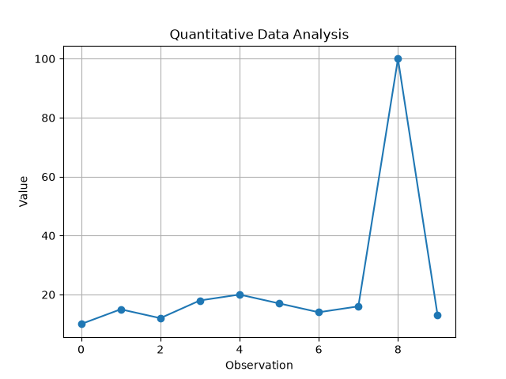
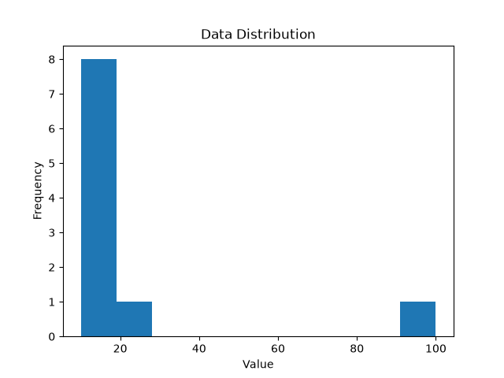
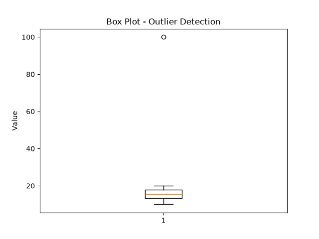

# Quantitative Data Analyzer
A Python-based data analysis application designed to perform statistical analysis, detect outliers, and visualize quantitative datasets.
## Features
- Load numerical data from CSV files
- Calculate mean and median
- Calculate variance and standard deviation
- Calculate minimum, maximum, and range
- Detect outliers using the IQR method
- Validate input data
- Handle invalid or missing CSV data
- Generate data visualizations
- Automated unit testing
## Technologies
- Python
- NumPy
- Pandas
- Matplotlib
- unittest
## Project Structure
```text
quantitative-data-analyzer/
├── main.py
├── analysis.py
├── data_loader.py
├── visualization.py
├── test_analysis.py
├── test_data_loader.py
├── data.csv
├── requirements.txt
└── .gitignore
```
## Installation
Clone the repository and install the required dependencies:
```bash
python3 -m pip install -r requirements.txt
```
## Usage
Run the application with:
```bash
python3 main.py
```
The program loads numerical data from `data.csv`, performs statistical analysis, detects outliers, and generates visualizations.
## Testing
Run all automated tests with:
```bash
python3 -m unittest
```
## Example Analysis
The application produces statistics including:
- Mean
- Median
- Variance
- Standard Deviation
- Minimum and Maximum
- Range
- Outliers

## Visualizations
### Data Trend

### Data Distribution

### Outlier Detection


## Purpose
This project demonstrates practical Python programming combined with mathematics and data analysis, with an emphasis on modular architecture, data validation, automated testing, and visualization.